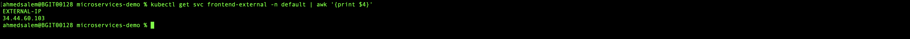

**Microservices Demo on Google Cloud with Terraform and CI/CD Pipeline**

## Overview

**Online Boutique** is a cloud-first microservices demo application.  The application is a
web-based e-commerce app where users can browse items, add them to the cart, and purchase them.

**This repository** contains the infrastructure and deployment configuration for the **Online Boutique** application on Google Cloud.

## Solution Design

The solution leverages Google Kubernetes Engine (GKE) to host the microservices application, with Terraform handling the infrastructure provisioning. A CI/CD pipeline is implemented using Google Cloud Build and Skaffold to ensure automated deployment and scalability.

## Acceptance Criteria

The project ensures best practices in Terraform-based infrastructure provisioning. This includes correct networking and security settings, such as adhering to required IP ranges and enforcing least privilege principles for IAM roles. A fully functional CI/CD pipeline deploys the microservices, exposing the frontend via a LoadBalancer.

## Architecture

**Online Boutique** is composed of 11 microservices written in different
languages that talk to each other over gRPC.

[](./diagram.png)


| Service                                              | Language      | Description                                                                                                                       |
| ---------------------------------------------------- | ------------- | --------------------------------------------------------------------------------------------------------------------------------- |
| [frontend](/src/frontend)                           | Go            | Exposes an HTTP server to serve the website. Does not require signup/login and generates session IDs for all users automatically. |
| [cartservice](/src/cartservice)                     | C#            | Stores the items in the user's shopping cart in Redis and retrieves it.                                                           |
| [productcatalogservice](/src/productcatalogservice) | Go            | Provides the list of products from a JSON file and ability to search products and get individual products.                        |
| [currencyservice](/src/currencyservice)             | Node.js       | Converts one money amount to another currency. Uses real values fetched from European Central Bank. It's the highest QPS service. |
| [paymentservice](/src/paymentservice)               | Node.js       | Charges the given credit card info (mock) with the given amount and returns a transaction ID.                                     |
| [shippingservice](/src/shippingservice)             | Go            | Gives shipping cost estimates based on the shopping cart. Ships items to the given address (mock)                                 |
| [emailservice](/src/emailservice)                   | Python        | Sends users an order confirmation email (mock).                                                                                   |
| [checkoutservice](/src/checkoutservice)             | Go            | Retrieves user cart, prepares order and orchestrates the payment, shipping and the email notification.                            |
| [recommendationservice](/src/recommendationservice) | Python        | Recommends other products based on what's given in the cart.                                                                      |
| [adservice](/src/adservice)                         | Java          | Provides text ads based on given context words.                                                                                   |
| [loadgenerator](/src/loadgenerator)                 | Python/Locust | Continuously sends requests imitating realistic user shopping flows to the frontend.                                              |


## Screenshots

| Home Page                                                                                                         | Checkout Screen                                                                                                    |
| ----------------------------------------------------------------------------------------------------------------- | ------------------------------------------------------------------------------------------------------------------ |
| [](././frontend-1.png) | [](./frontend-2.png)

## Prerequisites

- [Google Cloud project with an active project.](https://cloud.google.com/resource-manager/docs/creating-managing-projects#creating_a_project)
- Shell environment with `gcloud`, `git`, and `kubectl`.
- Google Cloud SDK installed.
- Docker installed and running.
- Terraform installed.
- GitHub account for source control.

## Setup Instructions

## Step 1: Set Up Google Cloud Environment

1. Create a Google Cloud Project:**
    - Navigate to Google Cloud Console.
    - Create a new project and note down the Project ID.

2. Enable Required APIs:
    - Kubernetes Engine API
    - Cloud Build API

3. Set Up Google Cloud Authentication:

    ```sh
    gcloud auth login
    gcloud auth application-default login
    gcloud config set project YOUR_PROJECT_ID
    ```

## Step 2: Infrastructure Provisioning with Terraform

1. Clone the Repository

    ```sh
    git clone https://github.com/AhmedSalem2020/microservices-demo.git
    cd microservices-demo
    ```

2. Creating Terraform Modules:
    - Before we proceed with infrastructure provisioning, we need to create the necessary Terraform modules for GKE, IAM, and networking. These modules will allow us to manage and scale our infrastructure efficiently.
	- The three modules we will create are:
	- GKE Module: Manages the Google Kubernetes Engine cluster.
	- IAM Module: Manages Identity and Access Management roles and permissions.
	- Networking Module: Manages the VPC, subnets, and other networking components.
	- The directory structure for the Terraform modules is as follows:
        ```sh
        ├── terraform
        │   ├── modules
        │   │   ├── gke-module
        │   │   │   ├── main.tf
        │   │   │   ├── variables.tf
        │   │   │   ├── outputs.tf
        │   │   ├── iam-module
        │   │   │   ├── main.tf
        │   │   │   ├── variables.tf
        │   │   │   ├── outputs.tf
        │   │   ├── networking-module
        │   │   │   ├── main.tf
        │   │   │   ├── variables.tf
        │   │   │   ├── outputs.tf
        ├── main.tf
        ├── variables.tf
        ├── outputs.tf
        ├── provider.tf
        └── backend.tf
        ```

3. Update Terraform Variables:
    - Modify `variables.tf` to set your project-specific values such as `project_id`, `region`, etc.

4. Initialize Terraform:

    ```sh
    terraform init
    ```

5. Run Terraform Plan:

    ```sh
    terraform plan
    ```

6. Apply Terraform Configuration:

    ```sh
    terraform apply
    ```

7.	Add Application Code:
    - After setting up the infrastructure, add the application code, which includes the necessary Kubernetes manifests, the cloudbuild.yaml configuration file for Google Cloud Build, and the skaffold.yaml file for managing the deployment of the application.
	- The application code structure in the repository should look like this:
        ```sh
        ├── kubernetes-manifests
        ├── kustomize
        ├── src
        ├── terraform
        ├── cloudbuild.yaml
        ├── skaffold.yaml
        ├── README.md
        └── .gitignore
        ```

## Step 3: CI/CD Pipeline with Google Cloud Build and Skaffold

1. Set Up Cloud Build Trigger:

    - Navigate to Cloud Build > Triggers in Google Cloud Console.
    - Create a new trigger to monitor changes in the GitHub repository.
    - Specify `cloudbuild.yaml` as the build configuration file.
    - Set up necessary environment variables.

2. You can trigger the Cloud Build in two ways:
    1.	Automated Trigger:
	    - The trigger is configured to automatically run whenever you push changes to the main branch. This ensures that every change is automatically deployed to the GKE cluster without any manual intervention.

	2.	Manual Build Trigger (Optional):
	    - You can manually trigger the Cloud Build using the following command:
        
        ```sh
        gcloud builds submit --config=cloudbuild.yaml --substitutions=_ZONE=us-central1-a,_CLUSTER=demo-app-staging .
        ```
        - Alternatively, you can manually trigger the build from the GCP Console:
            1.	Go to Cloud Build > Triggers.
            2.	Find the trigger you set up for the repository.
            3.	Click on Run or Trigger to manually start the build process.

3. Deploy Using Skaffold:

    - Skaffold is integrated with Cloud Build to manage the deployment of Kubernetes resources.

       [](./cloudBuild.png)


4. Wait for the pods to be ready.

   ```sh
   kubectl get pods -n default 
   ```

   After a few minutes, you should see the Pods in a `Running` state:

    [](./pods.png)

## Step 4: Access the Application

- Run the following command to get the external IP of the frontend service:

    ```sh
    kubectl get svc frontend-external -n default | awk '{print $4}'
    ```
     [](./svc.png)

- Access the application using the external IP in your web browser to access your instance of Online Boutique:

    ```
    http://<external IP>/
    ```

## Step 5: Clean Up Resources

- Destroy Terraform Resources:

    ```sh
    terraform destroy
    ```

- This will delete all the Google Cloud resources created during the setup.

## Conclusion

This setup provides a scalable and robust environment for running the Microservices Demo on Google Cloud. By leveraging Terraform for infrastructure as code and integrating a CI/CD pipeline, the solution is both automated and easy to manage.

## Deployment Considerations and When to Use Google Cloud Deploy

In this solution, we deploy the application to the GKE cluster using Cloud Build and Skaffold without relying on Google Cloud Deploy. This method is effective for scenarios where you need a simple and flexible CI/CD pipeline. It allows for rapid iteration and deployment, suitable for smaller projects or teams that prefer more control over their build and deployment process.

However, if your deployment needs involve `more complex pipelines, multiple environments (like dev, staging, production), and advanced deployment strategies such as canary releases, blue/green deployments`, or progressive delivery, then `Google Cloud Deploy might be the better option`. Google Cloud Deploy is a fully managed continuous delivery service that offers structured deployment pipelines, approval processes, and rollback capabilities, making it ideal for larger enterprise applications.