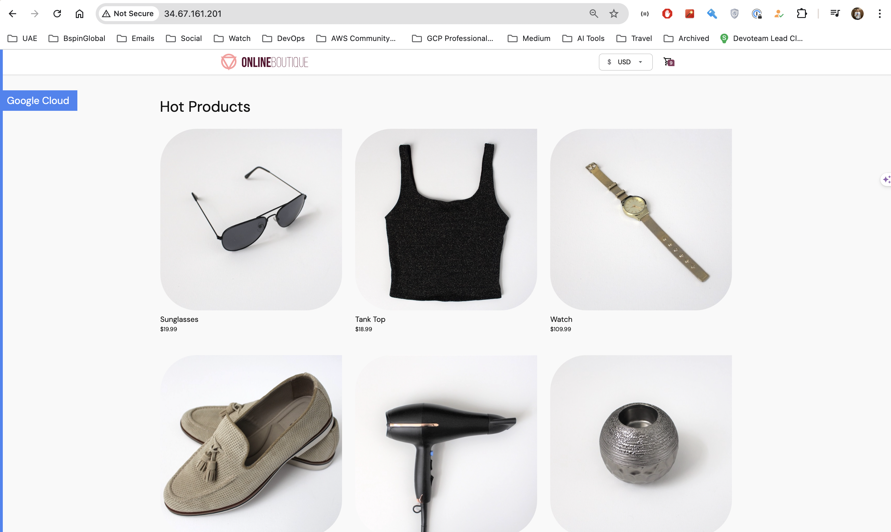
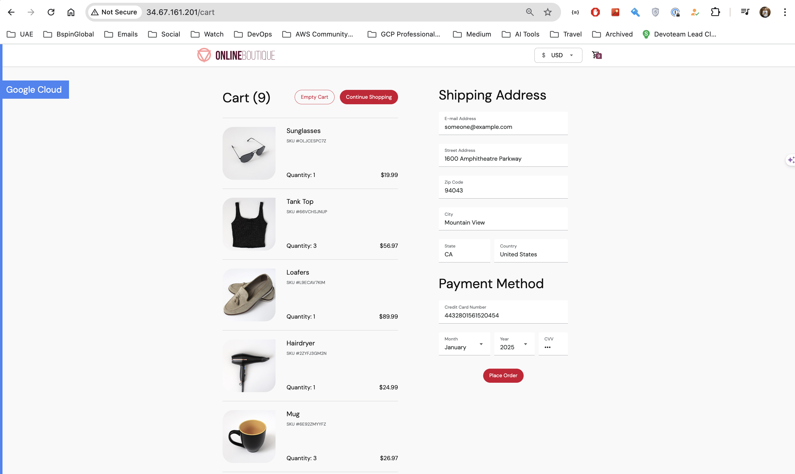
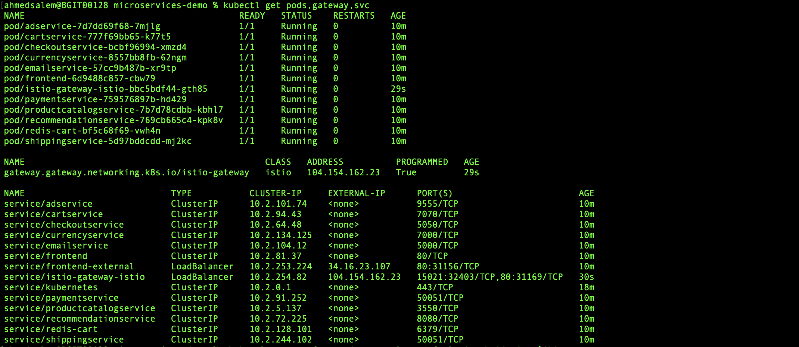
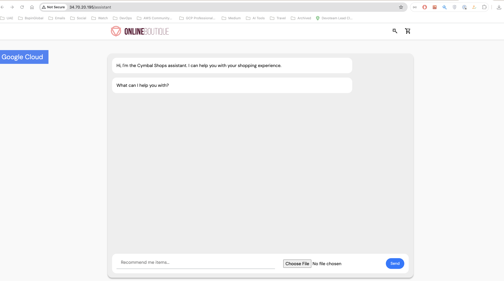
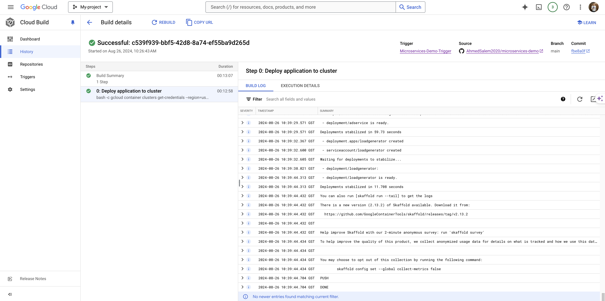
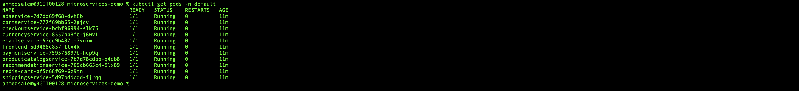

**Microservices Demo on Google Cloud with Terraform and CI/CD Pipeline**

## Overview

**Online Boutique** is a cloud-first microservices demo application.  The application is a
web-based e-commerce app where users can browse items, add them to the cart, and purchase them.

**This repository** contains the infrastructure and deployment configuration for the **Online Boutique** application on Google Cloud.

## Solution Design

The solution leverages Google Kubernetes Engine (GKE) to host the microservices application, with Terraform handling the infrastructure provisioning. A CI/CD pipeline is implemented using Google Cloud Build and Skaffold to ensure automated deployment and scalability.

## Acceptance Criteria

As a Client, I want to ensure that the infrastructure for the microservices application is provisioned using Terraform with best practices. This includes establishing correct networking and security configurations, such as adhering to required IP ranges and enforcing least privilege principles for IAM roles. Additionally, I want a fully functional CI/CD pipeline that automatically deploys the microservices to a GKE cluster, exposing the frontend via a LoadBalancer.

## Architecture

**Online Boutique** is composed of 11 microservices written in different
languages that talk to each other over gRPC.

[](./diagram.png)


| Service                                              | Language      | Description                                                                                                                       |
| ---------------------------------------------------- | ------------- | --------------------------------------------------------------------------------------------------------------------------------- |
| [frontend](/src/frontend)                           | Go            | Exposes an HTTP server to serve the website. Does not require signup/login and generates session IDs for all users automatically. |
| [cartservice](/src/cartservice)                     | C#            | Stores the items in the user's shopping cart in Redis and retrieves it.                                                           |
| [productcatalogservice](/src/productcatalogservice) | Go            | Provides the list of products from a JSON file and ability to search products and get individual products.                        |
| [currencyservice](/src/currencyservice)             | Node.js       | Converts one money amount to another currency. Uses real values fetched from European Central Bank. It's the highest QPS service. |
| [paymentservice](/src/paymentservice)               | Node.js       | Charges the given credit card info (mock) with the given amount and returns a transaction ID.                                     |
| [shippingservice](/src/shippingservice)             | Go            | Gives shipping cost estimates based on the shopping cart. Ships items to the given address (mock)                                 |
| [emailservice](/src/emailservice)                   | Python        | Sends users an order confirmation email (mock).                                                                                   |
| [checkoutservice](/src/checkoutservice)             | Go            | Retrieves user cart, prepares order and orchestrates the payment, shipping and the email notification.                            |
| [recommendationservice](/src/recommendationservice) | Python        | Recommends other products based on what's given in the cart.                                                                      |
| [adservice](/src/adservice)                         | Java          | Provides text ads based on given context words.                                                                                   |
| [loadgenerator](/src/loadgenerator)                 | Python/Locust | Continuously sends requests imitating realistic user shopping flows to the frontend.                                              |
| [shoppingassistantservice](/src/shoppingassistantservice)                 | Python | RAG-featured AI assistant to the frontned experience, helping users suggest products matching their home decor.                                              |

## Screenshots

| Home Page                                                                                                         | Checkout Screen                                                                                                    |
| ----------------------------------------------------------------------------------------------------------------- | ------------------------------------------------------------------------------------------------------------------ |
| [](././frontend-1.png) | [](./frontend-2.png)

## Prerequisites

- [Google Cloud project with an active project.](https://cloud.google.com/resource-manager/docs/creating-managing-projects#creating_a_project)
- Shell environment with `gcloud`, `git`, and `kubectl`.
- Google Cloud SDK installed.
- Docker installed and running.
- Terraform installed.
- GitHub account for source control.

## Setup Instructions

## Step 1: Set Up Google Cloud Environment

1. Create a Google Cloud Project:
    - Navigate to Google Cloud Console.
    - Create a new project and note down the Project ID.

2. Enable Required APIs:
    - Kubernetes Engine API
    - Cloud Build API
    - Service Mesh API

3. Set Up Google Cloud Authentication:

    ```sh
    gcloud auth login
    gcloud auth application-default login
    gcloud config set project YOUR_PROJECT_ID
    ```

## Step 2: Infrastructure Provisioning with Terraform

1. Clone the Repository

    ```sh
    git clone https://github.com/AhmedSalem2020/microservices-demo.git
    cd microservices-demo
    ```

2. Creating Terraform Modules:
   
   - Before we proceed with infrastructure provisioning, we need to create the necessary Terraform modules for GKE, IAM, and networking. These modules will allow us to manage and scale our infrastructure efficiently.
	- The three modules we will create are:
	- GKE Module: Manages the Google Kubernetes Engine cluster.
	- IAM Module: Manages Identity and Access Management roles and permissions.
	- Networking Module: Manages the VPC, subnets, and other networking components.
	- The directory structure for the Terraform modules is as follows:
       
        ```sh
        ├── terraform
        │   ├── modules
        │   │   ├── gke-module
        │   │   │   ├── main.tf
        │   │   │   ├── variables.tf
        │   │   │   ├── outputs.tf
        │   │   ├── iam-module
        │   │   │   ├── main.tf
        │   │   │   ├── variables.tf
        │   │   │   ├── outputs.tf
        │   │   ├── networking-module
        │   │   │   ├── main.tf
        │   │   │   ├── variables.tf
        │   │   │   ├── outputs.tf
        ├── main.tf
        ├── variables.tf
        ├── outputs.tf
        ├── provider.tf
        └── backend.tf
        ```

3. Update Terraform Variables:
    - Modify `variables.tf` to set your project-specific values such as `project_id`, `region`, etc.

4. Initialize Terraform:

    ```sh
    terraform init
    ```

5. Run Terraform Plan:

    ```sh
    terraform plan
    ```

6. Apply Terraform Configuration:

    ```sh
    terraform apply
    ```

7.	Add Application Code:
    
    - After setting up the infrastructure, add the application code, which includes the necessary Kubernetes manifests, the cloudbuild.yaml configuration file for Google Cloud Build, and the skaffold.yaml file for managing the deployment of the application.
	
    - The application code structure in the repository should look like this:
        
        ```sh
        ├── kubernetes-manifests
        ├── kustomize
        ├── src
        ├── terraform
        ├── cloudbuild.yaml
        ├── skaffold.yaml
        ├── README.md
        └── .gitignore
    
        ```
## Step 3: Integrate Istio Service Mesh (Optional)
1. Install & Deploy Istio:

	- You can use Istio to enable service mesh features such as traffic management, observability, and security. Istio can be provisioned using Anthos Service Mesh (ASM), the Open Source Software (OSS) istioctl tool, or via other Istio providers. You can then label individual namespaces for sidecar injection and configure an Istio gateway to replace the frontend-external load balancer.
	- Istio was provisioned using the GKE module in Terraform, with the installation managed by a null_resource block.

2. Enable service mesh istio component from `kustomize/kustomization.yaml`:

    - This will update the `kustomize/kustomization.yaml` file which could be similar to:
       
        ```sh
        apiVersion: kustomize.config.k8s.io/v1beta1
        kind: Kustomization
        resources:
        - base
        components:
        - components/service-mesh-istio
        ```
3. Verify Online Boutique Deployment:

    - Run `kubectl get pods,gateway,svc` to see pods and gateway are in a healthy and ready state.

        [](./istio-service-mesh.png)

4. Access the Application via Istio Gateway instead of using the frontend-external load balancer
    
    ```sh
    http://104.154.162.23/
    ```

## Step 4: Integrate AI Shopping Assistant (Optional)

1. Deploy AlloyDB Infrastructure

	- The AI Shopping Assistant is integrated using the GKE module in Terraform. Deploy the AlloyDB infrastructure using the provided scripts:
        
        ```sh
        /kustomize/components/shopping-assistant/scripts/1_deploy_alloydb_infra.sh
        ```

2. Populate AlloyDB with Initial Data

	- Populate the AlloyDB database with necessary tables and data by running:

        ```sh
        /kustomize/components/shopping-assistant/scripts/2_create_populate_alloydb_tables.sh
        ```

3. Deploy the Shopping Assistant Service

	- Deploy the Shopping Assistant service using the following command:

        ```sh
        kubectl apply -f kustomize/components/shopping-assistant/shoppingassistantservice.yaml
        ```

4. Patch the Frontend Deployment

	- Enable the Shopping Assistant in the frontend service by applying the following patch:

        ```sh
        kubectl patch deployment frontend --patch '{
        "spec": {
            "template": {
            "spec": {
                "containers": [
                {
                    "name": "server",
                    "env": [
                    {
                        "name": "ENABLE_ASSISTANT",
                        "value": "true"
                    }
                    ]
                }
                ]
            }
            }
        }
        }'
        ```

5. Access the Application
    
    - Access the application via the Istio Gateway and interact with the Shopping Assistant feature to ensure it is working correctly.

    [](./shoppingAssisstentservice.png)


## Step 5: CI/CD Pipeline with Google Cloud Build and Skaffold

1. Set Up Cloud Build Trigger:

    - Navigate to Cloud Build > Triggers in Google Cloud Console.
    - Create a new trigger to monitor changes in the GitHub repository.
    - Specify `cloudbuild.yaml` as the build configuration file.
    - Set up necessary environment variables.

2. You can trigger the Cloud Build in two ways:
    1.	Automated Trigger:
	    - The trigger is configured to automatically run whenever you push changes to the main branch. This ensures that every change is automatically deployed to the GKE cluster without any manual intervention.

	2.	Manual Build Trigger (Optional):
	    - You can manually trigger the Cloud Build using the following command:
        
        ```sh
        gcloud builds submit --config=cloudbuild.yaml --substitutions=_ZONE=us-central1-a,_CLUSTER=demo-app-staging .
        ```
        - Alternatively, you can manually trigger the build from the GCP Console:
            1.	Go to Cloud Build > Triggers.
            2.	Find the trigger you set up for the repository.
            3.	Click on Run or Trigger to manually start the build process.

        [](./cloudBuild.png)


3. Deploying the Application with Skaffold:

    - After triggering the build, Skaffold is used to manage the deployment of the application to the GKE cluster. Skaffold handles the build, tag, and deployment of your Kubernetes manifests.
	- You don’t need to run Skaffold manually, it is integrated within the Cloud Build process and automatically executed as part of the pipeline.
	- The deployment process starts with the execution of Skaffold defined in the skaffold.yaml file, which manages the deployment of Kubernetes resources based on the changes detected.


4. Monitoring the Deployment:
    - After the build and deployment are triggered, you can monitor the status of your Kubernetes Pods:

        ```sh
        kubectl get pods -n default 
        ```

    - After a few minutes, you should see the Pods in a `Running` state:

        [](./pods.png)

## Step 5: Clean Up Resources

- Destroy Terraform Resources:

    ```sh
    terraform destroy
    ```

- This will delete all the Google Cloud resources created during the setup.

## Deployment Considerations and When to Use Google Cloud Deploy

In this solution, we deploy the application to the `GKE cluster using Cloud Build and Skaffold` without relying on Google Cloud Deploy. This method is effective for scenarios where you need a `simple and flexible CI/CD pipeline`. It allows for rapid iteration and deployment, suitable for smaller projects or teams that prefer more control over their build and deployment process.

However, if your deployment needs involve `more complex pipelines, multiple environments (like dev, staging, production), and advanced deployment strategies such as canary releases, blue/green deployments`, or progressive delivery, then `Google Cloud Deploy might be the better option`. Google Cloud Deploy is a fully managed continuous delivery service that offers structured deployment pipelines, approval processes, and rollback capabilities, making it ideal for larger enterprise applications.

## Conclusion

This setup provides a comprehensive, scalable, and robust environment for running the Microservices Demo on Google Cloud. By leveraging Terraform for infrastructure as code, automating CI/CD with Skaffold, and integrating the Istio service mesh, the solution ensures enhanced traffic management, security, and observability. The combination of these technologies results in an automated, easy-to-manage, and highly effective cloud-native application deployment that is well-suited for modern microservices architectures. 


